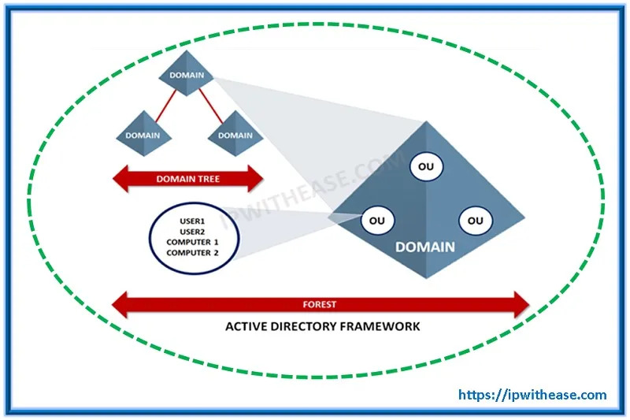
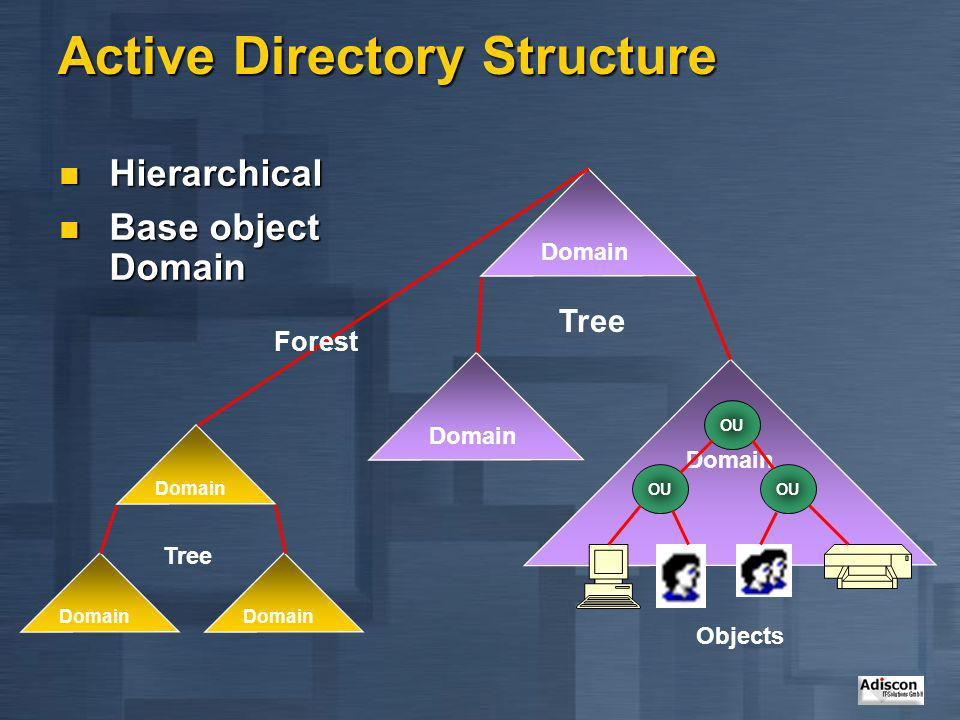
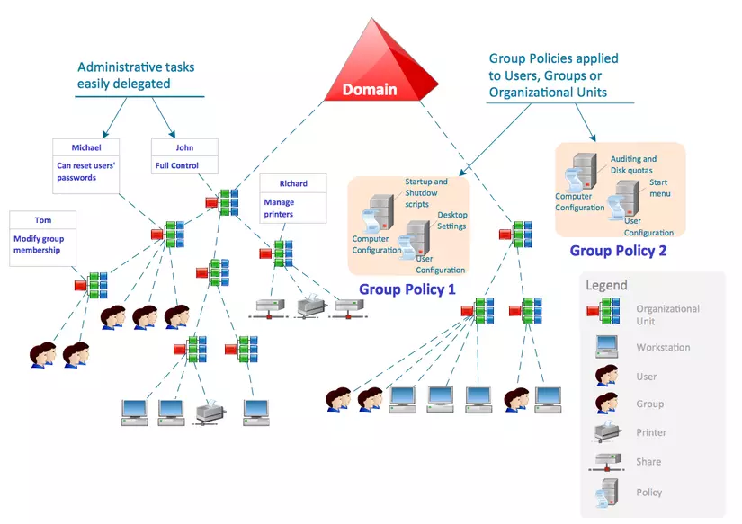
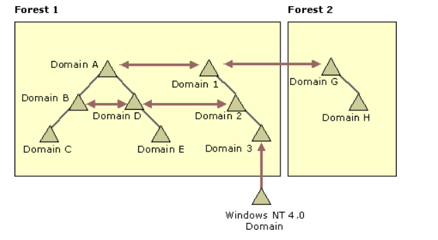
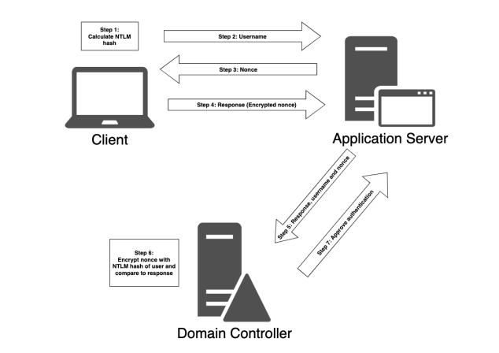
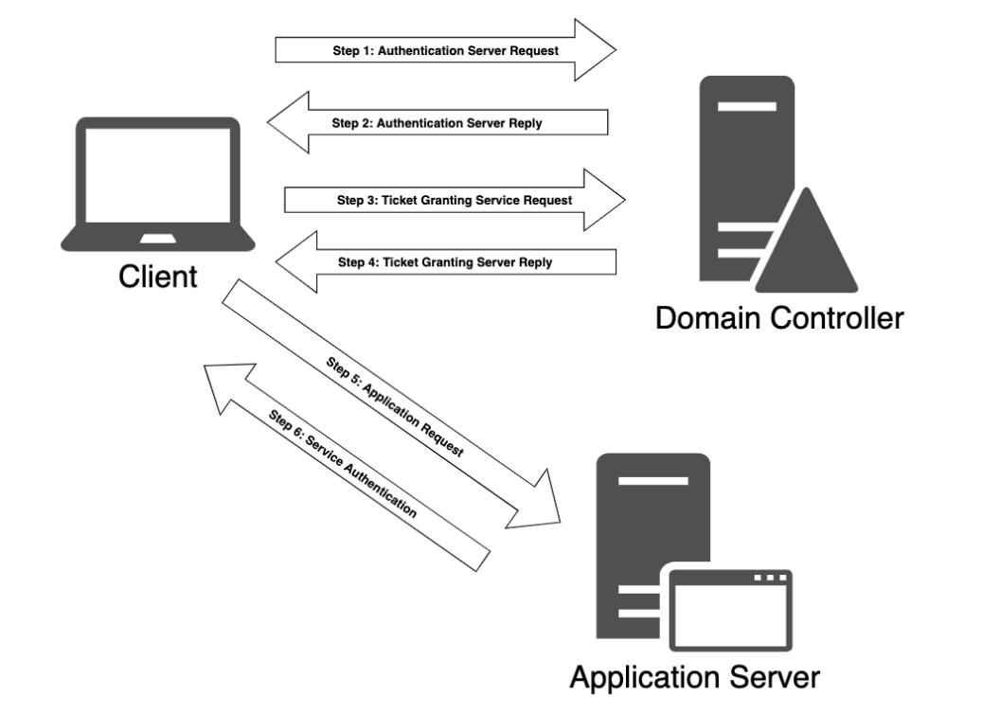
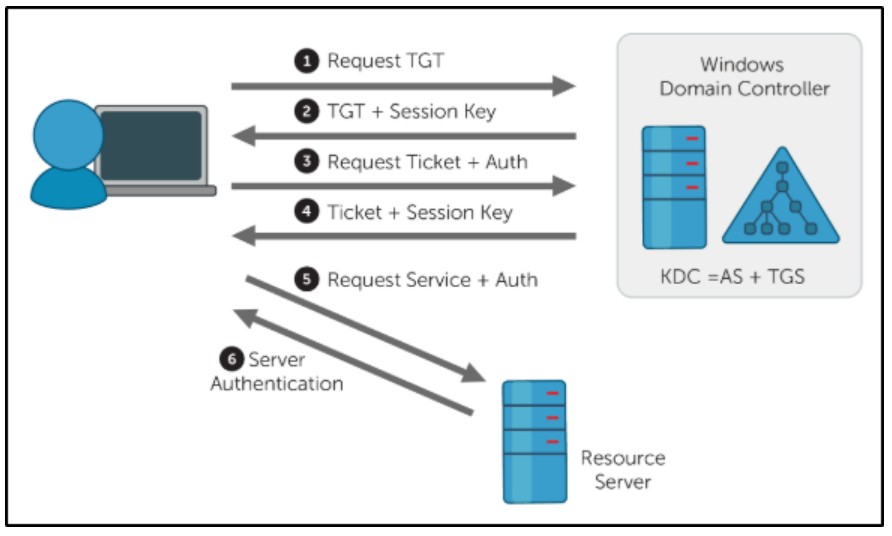

# Active Directory
1. [Overview](#overview)
2. [Forest](#forest)
3. [Domain Controllers](#domain-controllers)
4. [Trusts](#trusts)
	1. [Trust direction](#trust-direction)
	2. [Trust transitivity](#trust-transitivity)
	3. [Các loại trusts](#các-loại-trusts)
	4. [Trust key](#trust-key)
5. [Users](#users)
	1. [Thuộc tính người dùng](#thuộc-tính-người-dùng)
	2. [Important Users](#important-users)
	3. [Computer accounts](#computer-accounts)
	4. [Trust accounts](#trust-accounts)
6. [Groups](#groups)
	1. [Important groups](#important-groups)
	2. [Phạm vi nhóm](#phạm-vi-nhóm)
7. [Database](#database)
8. [Security in AD](#security-in-ad)
	1. [Address resolution](#address-resolution)
	2. [Authentication](#authentication)


## Overview
Active Directory là dịch vụ thư mục (*the directory service*) dành cho Windows Domain Networks, một hệ thống được chuẩn hóa với khả năng quản trị tập trung về người dùng cũng như các nguồn tài nguyên trong một hệ thống mạng.





**Ví dụ :**

Tập đoàn Bkav có hàng nghìn nhân viên, mỗi người làm việc trên một máy tính. Công ty này có một số bộ phân khác nhau như BANM, BCN, SPANM, ....

Một ngày nào đó Bkav phát triển ra một phần mềm và  yêu cầu tất cả mọi người cài đặt trên máy tính cá nhân của nhân viên, hoặc mỗi ngày có một người trong một phòng ban khác nhau quên mật khẩu và cần được khôi phục hoặc một nhóm thực tập sinh mới chỉ được truy cập vào một vài tài liệu nhất định trên server.

Người quản trị hệ thống có nên cài đặt phần mềm trên từng máy một? Họ có thể đến từng phòng ban khác nhau để khôi phục mật khẩu cho người dùng? Họ có nên tạo một người dùng mới cho mỗi sinh viên thực tập trong server đó và chỉ cho phép họ xem các tệp trong 1 thư mục không?

Tất nhiên là họ có thể làm như vậy nhưng nó sẽ tốn rất nhiều công sức và tiền bạc cho công ty. Thay vì đó họ có thể kết nối tất cả các máy tính vào một mạng Active Directory, từ đó họ có thể thực hiện các hoạt động này trên máy của họ.

Active Directory cho phép điều này bằng cách duy trì một cơ sở dữ liệu tập trung, nơi lưu trữ tất cả thông tin về người dùng, máy tính, chính sách, quyền, v.v. Vì vậy, ví dụ, người quản trị có thể kết nối với cơ sở dữ liệu này và tạo người dùng mới cho các sinh viên thực tập và phân quyền cho họ để chỉ được phép đọc các tệp trong thư mục được chỉ định của các máy chủ cụ thể của phòng ban của họ.

Tương tự như vậy, trong trường hợp người dùng quên mật khẩu, cô ấy có thể cảnh báo cho nhóm quản trị và họ có thể thay đổi mật khẩu người dùng trong cơ sở dữ liệu trung tâm này.

Trong trường hợp của bộ phận dự án, người quản trị có thể tạo một chính sách mới trong cơ sở dữ liệu chỉ ra rằng các máy tính của bộ phận đó phải cài đặt chương trình được chỉ định và cách thực hiện. Sau đó, khi máy tính đọc cơ sở dữ liệu, chúng sẽ biết rằng chúng phải thực thi chính sách này và chương trình mới sẽ được cài đặt.

## Forest

Forest hiểu đơn giản nó giống như 1 container chứa 1 hoặc nhiều domain bên trong mạng Active Directory. Các domain sau đó sẽ lưu trữ các objects (đối tượng) như OU, group, user,... và các dịch vụ khác .

`The Forest` gồm:
-   Trees - Một hệ thống phân cấp domains trong Active Directory Domain Services
-   Domains - Used to group and manage objects 
-   Organizational Units (OUs) - Containers for groups, computers, users, printers and other OUs
-   Trusts - Allows users to access resources in other domains
-   Objects - users, groups, printers, computers, shares
-   Domain Services - DNS Server, LLMNR, IPv6
-   Domain Schema - chứa các định nghĩa của mọi lớp đối tượng trong forest và các quy tắc kiểm soát việc tạo và thao tác các đối tượng.

## Domain Controllers
`Domain Controllers` là một Windows server đã cài đặt Active Directory Domain Services (AD DS) và đã được thăng cấp thành a domain controller trong  the forest.

Domain Controllers là **máy chủ trung tâm của một miền** , đang chạy [Dịch vụ miền Active Directory](https://docs.microsoft.com/en-us/windows-server/identity/ad-ds/get-started/virtual-dc/active-directory-domain-services-overview) (AD DS). Điều đó có nghĩa là nó có trách nhiệm lưu giữ cơ sở dữ liệu miền với tất cả thông tin về các đối tượng miền và cung cấp các dịch vụ Active Directory, chẳng hạn như xác thực, ủy quyền, phân giải tên, v.v.

Cơ sở dữ liệu được lưu trữ trong tệp `C:\Windows\NTDS\ntds.dit` . Do đó, nếu ai đó đánh cắp tệp này, họ có thể truy cập vào tất cả thông tin về các đối tượng của domain (máy tính, người dùng, nhóm, chính sách, v.v.), bao gồm cả thông tin đăng nhập của người dùng.

Tất cả các computer trong domain đều phải giao tiếp với **Domain Controller** để hỏi thông tin về database, do đó the Domain Controller có thể truy cập được từ bất kỳ phần nào của mạng.

Thông thường, trong một miền có nhiều hơn một Domain Controllers, để phân phối khối lượng công việc và ngăn chặn các điểm lỗi duy nhất. Ngoài ra, như bất kỳ máy chủ cơ sở dữ liệu nào khác, Domain Controller phải được đồng bộ hóa với nhau để giữ cho dữ liệu được cập nhật.

Hơn nữa, để cho phép máy tính và người dùng truy cập vào dữ liệu cơ sở dữ liệu, domain controller cung cấp một loạt dịch vụ như DNS, Kerberos, LDAP, SMB, RPC, v.v.

`The Active Directory Data Store` nắm giữ cơ sở dữ liệu và quy trình cần thiết để lưu trữ và quản lý thông tin thư mục như users, groups, and services

Nội dung và đặc điểm của `The Active Directory Data Store` :
-  Chứa the NTDS.dit -  database chứa tất cả các thông tin của Active Directory domain controller như là  password hashes của domain users
-   Được lưu trữ mặc định tại %SystemRoot%\NTDS
-   Chỉ có thể truy cập bởi the domain controller

## Trusts
Người dùng có thể truy cập vào các tên miền khác trong cùng forest vì chúng được liên kết bằng các kết nối được gọi là **Trusts** .

Không phải là kết nối mạng vật lý, mà là một loại kết nối xác thực / ủy quyền. Bạn có ngồi vào computer ở trong các miền khác, nhưng bạn không thể đăng nhập trên các máy tính đó bằng người dùng của miền này. Nhưng với  `trust`  sẽ cho phép bạn làm được điều đó.

### Trust direction.

Trust là 1 mối quan hệ trong đó một bên là the trusting và  bên kia là  trusted. Khi liên kết này được thiết lập, người dùng của trusted domain có thể truy cập vào tài nguyên của trusting domain.

Hướng **trust** sẽ ngược lại với hướng truy cập. 

```none
 (trusting)         trusts        (trusted)
  Domain A  -------------------->  Domain B
                    access
            <--------------------
```

### Trust transitivity

Trust có tính bắc cầu do đó người dùng trên domain C có thể truy cập tài nguyên của người dùng trên domain A

```none
      (trusting)   trusts   (trusted)  (trusting)   trusts   (trusted)
  Domain A  ------------------->  Domain B --------------------> Domain C
                    access                          access
            <-------------------           <--------------------
```

### Các loại trusts

Trong Active Directory có một số [trusts](https://docs.microsoft.com/en-us/previous-versions/windows/it-pro/windows-server-2008-r2-and-2008/cc730798(v=ws.10)#trust-types) cho các mục đích khác nhau:

-   **Parent-Child** : `Trust` mặc định được tạo giữa domain mẹ và domain con trong 1 tree.
-   [**Forest**](https://docs.microsoft.com/en-us/previous-versions/windows/it-pro/windows-server-2008-r2-and-2008/cc771397(v=ws.10)) : `Trust` để chia sẻ tài nguyên giữa các `forest`. Bằng cách này, bất kỳ miền nào của `forest` này cũng có thể truy cập vào bất kỳ miền nào trong `forest` kia (nếu direction and transitivity của trust cho phép điều đó). 
-   [**External**](https://docs.microsoft.com/en-us/previous-versions/windows/it-pro/windows-server-2008-r2-and-2008/cc732859(v=ws.10)) : `Trust` để kết nối với một domain trong một **forest** bên ngoài.


-   [**Realm**](https://docs.microsoft.com/en-us/previous-versions/windows/it-pro/windows-server-2008-r2-and-2008/cc731297(v=ws.10)) : `Trust` đặc biệt để kết nối Active Directory với domain không phải Windows.
-   [**Shortcut**](https://docs.microsoft.com/en-us/previous-versions/windows/it-pro/windows-server-2008-r2-and-2008/cc754538(v=ws.10)) : Shortcut trust cần thiết khi nhiều người dùng trong một domain thường xuyên đăng nhập vào các domain khác trong forest thay vì phải xác thực theo trust giữa các trees.


### Trust key
Về mặt kỹ thuật, khi bạn sử dụng trust, có một giao tiếp giữa domain controller của domain bạn và domain controller của domain đích (hoặc của domain trung gian).

Cách giao tiếp được thực hiện khác nhau tùy thuộc vào giao thức đang được sử dụng (có thể là NTLM, Kerberos, v.v.), nhưng trong mọi trường hợp, domain controller cần chia sẻ một key để giữ an toàn cho giao tiếp. Khóa này được gọi là `trust key` và nó được tạo ra khi trust được thiết lập.

Khi một trust được tạo, một `trust account` sẽ được tạo trong cơ sở dữ liệu miền như thể đó là một người dùng (với ký tự cuối `$`). Sau đó, trust key được lưu trữ  là mật khẩu của trust user.

```powershell
PS C:\Users\Administrator> Get-ADUser  -LDAPFilter "(SamAccountName=*$)" | select SamAccountName
SamAccountName
--------------
H4NX0X_NetBIOS$
```

 **More on trusts**
-   [It’s All About Trust – Forging Kerberos Trust Tickets to Spoof Access across Active Directory Trusts](https://adsecurity.org/?p=1588)
-   [Active Directory forest trusts part 1 - How does SID filtering work?](https://dirkjanm.io/active-directory-forest-trusts-part-one-how-does-sid-filtering-work/)
-   [Inter-Realm Key Roasting (well… within the first 30 days)](https://blog.xpnsec.com/inter-realm-key-roasting/)

## Users

Một trong những thứ quan trọng để sử dụng Active Directory là quản lý người dùng. Mọi tổ chức quản lý người dùng của mình theo những cách khác nhau, đặt định dạng tên cho họ, gán các quyền khác nhau, v.v.

Để dễ dàng quản lý người dùng trong Active Directory, chúng được lưu trữ như một đối tượng trong cơ sở dữ liệu trung tâm có thể được truy xuất và thao tác từ bất kỳ nơi nào trong miền (nếu bạn có đủ quyền).

### Thuộc tính người dùng

#### Mã định danh người dùng

Đối tượng người dùng lưu trữ nhiều dữ liệu khác nhau nhưng các thuộc tính đầu tiên cần chú ý đến là những thuộc tính cho phép chúng ta xác định một người dùng.

Để xác định user, ta sẽ trích xuất username được lưu trữ trong thuộc tính **SamAccountName** . Ngoài ra, **SID** (Security Identifier-Mã định danh bảo mật) cũng có thể được sử dụng để xác định user.

SID user tương tự như SID domain và trên thực tế thuộc tính SID là sự kết hợp của SID domain và RID người dùng (mã định danh đối tượng)- là số cuối cùng trong SID người dùng

```powershell
PS C:\Users\Administrator> Get-ADUser test1


DistinguishedName : CN=test1,CN=Users,DC=h4nx0x,DC=local
Enabled           : True
GivenName         : test1
Name              : test1
ObjectClass       : user
ObjectGUID        : fd81ef36-ca5a-4a53-aa1d-f5e93b3df129
SamAccountName    : test1
SID               : S-1-5-21-1061463832-3217990070-361583772-1105
Surname           :
UserPrincipalName : test1@h4nx0x.local


PS C:\Users\Administrator> Get-ADUser test


DistinguishedName : CN=test,CN=Users,DC=h4nx0x,DC=local
Enabled           : True
GivenName         : test
Name              : test
ObjectClass       : user
ObjectGUID        : 4010ac42-ceb4-4f96-8ed0-1529cbede3ed
SamAccountName    : test
SID               : S-1-5-21-1061463832-3217990070-361583772-1104
Surname           :
UserPrincipalName : test@h4nx0x.local

```

Trong trường hợp này thì SID domain là `S-1-5-21-1061463832-3217990070-361583772`và RID user là `1105`.

#### User Secrets

Database lưu trữ user secrets để Domain Controller xác thực người dùng. Mật khẩu người dùng không được lưu trữ trong bản rõ, và được lưu trữ dưới dạng:
-   NT/LM hash 
-   Kerberos keys 

Chúng được lưu trữ tại `C:\Windows\NTDS\ntds.dit`  của domain controller.

#### UserAccountControl

Một thuộc tính thú vị của lớp người dùng là [UserAccountControl](https://docs.microsoft.com/en-us/troubleshoot/windows-server/identity/useraccountcontrol-manipulate-account-properties) (UAC)

Thuộc tính UserAccountControl chứa một loạt các cờ rất liên quan đến bảo mật và domain và được sử dụng trong nhiều cuộc tấn công.

#### Thuộc tính người dùng khác cần chú ý

-   [Description](https://docs.microsoft.com/en-us/windows/win32/adschema/a-description) -> Mô tả về user. Nó có thể đưa ra quyền của user, đôi khi bao gồm cả password
-   [AdminCount](https://docs.microsoft.com/en-us/windows/win32/adschema/a-admincount) -> Cho biết user (or group) được protected bởi [AdminSDHolder](https://adsecurity.org/?p=1906) object. 
-   **MemberOf** -> Các nhóm mà user là thành viên. 
-   [PrimaryGroupID](https://docs.microsoft.com/en-us/windows/win32/adschema/a-primarygroupid) -> Mã định danh của Group
-   [ServicePrincipalName](https://docs.microsoft.com/en-us/windows/win32/adschema/a-serviceprincipalname) -> Tên/mã định danh dịch vụ trong AD

### Important Users

```powershell
PS C:\Users\Administrator> Get-ADUser -Filter * | select SamAccountName

SamAccountName
--------------
Administrator
Guest
krbtgt
test
test1
DOMAIN11$
DOMAIN2$

```

Theo mặc định, người dùng  `Administrator` là tài khoản đặc quyền nhất của miền . Nó có thể thực hiện bất kỳ hành động nào trong bất kỳ máy tính nào. Vì vậy, nếu bạn có thể xâm phạm tài khoản này, bạn có thể có toàn quyền kiểm soát miền (và thậm chí cả forest bằng cách sử dụng [the SID history attack](https://adsecurity.org/?p=1640) ).

Ngoài ra, tài khoản`krbtgt` cũng rất quan trọng. Secret của nó (mã băm NT và khóa Kerberos) được sử dụng để mã hóa các vé (cụ thể là TGT) được sử dụng bởi Kerberos cho phép xác thực người dùng. Nếu bạn có thể xâm nhập `krbtgt`tài khoản, bạn sẽ có thể tạo [Vé vàng](https://en.hackndo.com/kerberos-silver-golden-tickets/) . Thông thường, tài khoản này chỉ có thể bị xâm phạm bằng cách dump domain database, vì nó chỉ được sử dụng trong domain controller, điều này sẽ yêu cầu bạn có đặc quyền administrator trong miền.


### Computer accounts

Một điều khác cần lưu ý là trong một tổ chức, mỗi người có `user` riêng và thậm chí một số người nhất định như bộ phận CNTT có thể có nhiều `users` cho mỗi người để thực hiện các nhiệm vụ khác nhau. Hơn nữa, **mỗi máy tính trong domain cũng có user riêng** , vì họ cũng cần thực hiện các hành động của riêng mình trong miền, chẳng hạn như cập nhật Chính sách nhóm, xác minh thông tin đăng nhập của người dùng miền đã đăng nhập vào máy tính, v.v.	

[Computer user](https://docs.microsoft.com/en-us/windows/win32/adschema/c-computer) là một lớp con của `user class` . Hơn nữa,  tên  của `Computer user` được kết thúc bằng ký hiệu đô la `$`

More( [Computer user](https://docs.microsoft.com/en-us/windows/win32/adschema/c-user),  [User class](https://docs.microsoft.com/en-us/windows/win32/adschema/c-user))
-  Ví dụ: 
```powershell
PS C:\Users\Administrator> Get-ADObject -LDAPFilter "objectClass=User" -Properties SamAccountName | select SamAccountName

SamAccountName
--------------
Administrator
Guest
WIN-S98829HRC7E$
krbtgt
test
test1
TEST1$
DOMAIN11$
DOMAIN2$

```

### Trust accounts
Tuy nhiên, cũng có tài khoản `DOMAIN2` xuất hiện trong cả hai `Get-ADUser` và `Get-ADObject`, nhưng tên được kết thúc bằng ký hiệu đô la. Đó có thể là người dùng bình thường (có thể được tạo tên người dùng với ký tự cuối `$`). Tuy nhiên,  có một trust được thiết lập với domain `domain2.local`.

Khi trust được thiết lập, một đối tượng người dùng được tạo trong mỗi domain để lưu trữ `trush key`. Tên của user là tên NetBIOS của miền khác, được kết thúc bằng bằng $ (tương tự như computer user). 

Ví dụ: doamin `h4nx0x.local` và  `domain2.local` trust 2 chiều, do đó domain `h4nx0x.local` sẽ chứa tài khoản `domain2$` và domain `domain2.local` sẽ chứa tài khoản `H4NX0X_NetBIOS$` 

```powershell
#domain domain2.local
PS C:\Users\Administrator> Get-ADObject -LDAPFilter "objectClass=User" -Properties SamAccountName | select SamAccountNam
e

SamAccountName
--------------
Administrator
Guest
DOMAIN1$
krbtgt
H4NX0X_NetBIOS$

#domain h4nx0x.local
PS C:\Users\Administrator> Get-ADObject -LDAPFilter "objectClass=User" -Properties SamAccountName | select SamAccountNam
e

SamAccountName
--------------
Administrator
Guest
WIN-S98829HRC7E$
krbtgt
test
test1
TEST1$
DOMAIN11$
DOMAIN2$

```

Đối tượng người dùng `DOMAIN2$` và `H4NX0X_NetBIOS$` được sử dụng để lưu trữ các  trust key, là các khóa NT hash hoặc Kerberos (một trong 2 khóa được sử dụng tùy thuộc vào ngữ cảnh). Nếu bạn có thể dump `the secret` của tài khoản này, bạn có thể tạo [inter-realm Kerberos tickets](https://adsecurity.org/?p=1588) .

## Groups
### Important groups
#### Administrative groups
Trong Active Directory có nhiều [nhóm mặc định](https://docs.microsoft.com/en-us/windows/security/identity-protection/access-control/active-directory-security-groups#default-security-groups) được xác định cho các vai trò khác nhau trong domain/forest. Với tư cách là attacker, một trong những nhóm hấp dẫn nhất là nhóm [Domain Admins](https://docs.microsoft.com/en-us/windows/security/identity-protection/access-control/active-directory-security-groups#bkmk-domainadmins) , nhóm này cấp quyền quản trị viên cho các thành viên trong domain. Do đó việc xác định được thành viên trong nhóm này là 1 điều quan trọng.

Nhưng cũng có những nhóm quan trọng khác có thể cung cấp cho bạn rất nhiều đặc quyền, và thậm chí nhiều hơn thế. Ví dụ:  [Enterprise Admins](https://docs.microsoft.com/en-us/windows/security/identity-protection/access-control/active-directory-security-groups#bkmk-entadmins) group , nhóm này cung cấp các đặc quyền của quản trị viên trong `forest`.
`Enterprise Admins` chỉ được tạo trong `root domain` của `forest` nhưng nó được thêm mặc định vào [Administrators](https://docs.microsoft.com/en-us/windows/security/identity-protection/access-control/active-directory-security-groups#administrators) group của tất các `domain` trong `forest`.
Mặt khác, Các thành viên trong `Domain Admins` group được thêm vào `Administrators group` của `domain` và `domain computers`.

```text
                        .------------------------.
                        |     h4nx0x.local      |
       .-------------------------------------------------------------.
       |                                                             |
       |                   .----------------.                        |  
       |               .-->| Administrators |<-.   .->Administrators |
       |               |   '----------------'  |   |     ____        | 
       |               |    .---------------.  |   |    |    |       |
       |               |    | Domain Admins |>-'---'    |____|       |
       |               |    '---------------'           /::::/       |
       |               |   .-------------------.                     |
       |               '--<| Enterprise Admins |                     |
       |                   '-------------------'                     |
       |                             v v                             |
       '-----------------------------|-|-----------------------------'  
                           |         | |      |                         
                           |         | |      |                         
                 .---------'         | |      '-----------.             
                 |                   v v                  |             
.----------------------------------. | | .----------------------------------.
|        ha1.h4nx0x.local          | | | |        ha2.h4nx0x.local          |
|----------------------------------| | | |----------------------------------|
|                                  | v v |                                  |
|        .----------------.        | | | |        .----------------.        |
|     .->| Administrators |<---------' '--------->| Administrators |<-.     |
|     |  '----------------'        |     |        '----------------'  |     |
|     |  .---------------.         |     |        .---------------.   |     |
|     '-<| Domain Admins |         |     |        | Domain Admins |>--'     |
|        '---------------'         |     |        '---------------'         |
|                |                 |     |                |                 |
|        .-------'---------.       |     |        .-------'---------.       |
|        |                 |       |     |        |                 |       |
|        v                 v       |     |        v                 v       |
| Administrators    Administrators |     | Administrators    Administrators |
|       ____              ____     |     |      ____              ____      |
|      |    |            |    |    |     |     |    |            |    |     |
|      |____|            |____|    |     |     |____|            |____|     |
|      /::::/            /::::/    |     |     /::::/            /::::/     |
'----------------------------------'     '----------------------------------'
```

#### Other important groups
- [**Schema Admins**](https://docs.microsoft.com/en-us/windows/security/identity-protection/access-control/active-directory-security-groups#schema-admins) có thể chỉnh sửa the Active Directory [database](https://zer1t0.gitlab.io/posts/attacking_ad/#database) schema
- **Remote Desktop Users**: thành viên  của  [Remote Desktop Users](https://docs.microsoft.com/en-us/windows/security/identity-protection/access-control/active-directory-security-groups#bkmk-remotedesktopusers) có thể  log in  vào  Domain Controller bằng remote desktop
- **Backup Operators**: Thành viên của [Backup Operators](https://docs.microsoft.com/en-us/windows/security/identity-protection/access-control/active-directory-security-groups#backup-operators) có thể  back up and lưu trữ files trong Domain Controllers 
- **Server Operators**: [Server Operators](https://docs.microsoft.com/en-us/windows/security/identity-protection/access-control/active-directory-security-groups#server-operators) có thể log in Domain Controllers and quản lí  cấu hình 
- vv.vv.....

### Phạm vi nhóm

Trong Active Directory có ba loại nhóm khác nhau dựa trên [phạm vi của chúng](https://docs.microsoft.com/en-us/windows/security/identity-protection/access-control/active-directory-security-groups#group-scope)  Hiểu chúng sẽ giúp ta cách quản lý domain và forest:

-   Nhóm **Universal** , có thể có các thành viên cùng forest và có thể cấp quyền trong  forest or trusted forests. Nhóm `Enterprise Admins` là một ví dụ của nhóm Universal.
-   Nhóm **Global groups** , chỉ có thể có các thành viên của cùng một domain và cấp quyền cho các domain cùng forest hoặc trust domain . Nhóm `Domain Admins` là một ví dụ về **Global groups**.
-   Cuối cùng, **nhóm DomainLocal** có thể có các thành viên the domain or any trusted domain và chỉ cấp quyền trong miền của họ. Nhóm `Administrators` là một ví dụ về nhóm DomainLocal.

Ngoài ra **domain groups (and domain users)** cũng có thể là thành viên của **computer local groups**.

## Database

Domain database được lưu trữ trong Domain controller tại `C:\Windows\NTDS\ntds.dit` và cơ sở dữ liệu này được các domain controller đồng bộ hóa với nhau.

Đầu tiên ta sẽ nói về cấu trúc của database. Active Directory database có một [schema](https://docs.microsoft.com/en-us/previous-versions/windows/it-pro/windows-server-2003/cc773309(v=ws.10)) để define các [object classes](https://docs.microsoft.com/en-us/windows/win32/adschema/classes) khác nhau. Mỗi lớp có các thuộc tính khác nhau và phục vụ cho các mục đích khác nhau. Ví dụ: [User class](https://docs.microsoft.com/en-us/windows/win32/adschema/c-user),  [Computer class](https://docs.microsoft.com/en-us/windows/win32/adschema/c-computer) hoặc [Group class](https://docs.microsoft.com/en-us/windows/win32/adschema/c-group).

[Global Catalogs](https://docs.microsoft.com/pt-pt/previous-versions/windows/server/cc737410(v=ws.10)#domain-controller-and-global-catalog-server-structure) là một bản lưu rút gọn về các objects cũng như như thuộc tính thường được sử dụng nhiều của Active Directory Database, được sử dụng để xác thực khi user log in. 
Hiểu đơn giản là Domain controller lưu tất cả các dữ liệu trên 1 tệp duy nhất. Do đó để đơn giản hóa  việc truy xuất dữ liệu cũng như login thì Global Catalog sẽ giúp ta truy xuất dữ liệu nhanh hơn


### How to query the database?
Để tương tác với dữ liệu cơ sở dữ liệu,Domain Controller cung cấp cho bạn một số tùy chọn để translate trong các  protocols/services khác nhau mà chúng hỗ trợ.

#### LDAP
[LDAP](https://en.wikipedia.org/wiki/Lightweight_Directory_Access_Protocol)(Lightweight Directory Access Protocol) là 1 giao thức client-server để truy cập các dịch vụ thư mục (có thể truy cập domain database như là Global Catalog).

LDAP cho phép bạn filter các đối tượng mà bạn muốn truy xuất/chỉnh sửa cơ sở dữ liệu. Bạn có thể filter các đối tượng dựa trên các thuộc tính của nó. Ví dụ, để truy xuất các nhóm của miền có thành viên, bạn có thể sử dụng truy vấn sau `(&(objectsclass=group)(members=*))`.

Ngoài các filter, LDAP cũng cho phép bạn chỉ định các thuộc tính bạn muốn lấy cho từng đối tượng. 

Detail: [LDAP wiki](https://ldapwiki.com/) 

```bash
~$ ldapsearch -H ldap://192.168.100.2 -x -LLL -W -D "anakin@contoso.local" -b "dc=contoso,dc=local" "(&(objectclass=group)(member=*))" "samaccountname"
Enter LDAP Password: 
dn: CN=Administrators,CN=Builtin,DC=contoso,DC=local
sAMAccountName: Administrators

dn: CN=Users,CN=Builtin,DC=contoso,DC=local
sAMAccountName: Users

dn: CN=Guests,CN=Builtin,DC=contoso,DC=local
sAMAccountName: Guests

dn: CN=Remote Desktop Users,CN=Builtin,DC=contoso,DC=local
sAMAccountName: Remote Desktop Users

dn: CN=IIS_IUSRS,CN=Builtin,DC=contoso,DC=local
sAMAccountName: IIS_IUSRS

dn: CN=Schema Admins,CN=Users,DC=contoso,DC=local
sAMAccountName: Schema Admins

dn: CN=Enterprise Admins,CN=Users,DC=contoso,DC=local
sAMAccountName: Enterprise Admins

dn: CN=Domain Admins,CN=Users,DC=contoso,DC=local
sAMAccountName: Domain Admins

dn: CN=Group Policy Creator Owners,CN=Users,DC=contoso,DC=local
sAMAccountName: Group Policy Creator Owners

dn: CN=Pre-Windows 2000 Compatible Access,CN=Builtin,DC=contoso,DC=local
sAMAccountName: Pre-Windows 2000 Compatible Access

dn: CN=Windows Authorization Access Group,CN=Builtin,DC=contoso,DC=local
sAMAccountName: Windows Authorization Access Group

dn: CN=Denied RODC Password Replication Group,CN=Users,DC=contoso,DC=local
sAMAccountName: Denied RODC Password Replication Group

# refldap://ForestDnsZones.contoso.local/DC=ForestDnsZones,DC=contoso,DC=local

# refldap://DomainDnsZones.contoso.local/DC=DomainDnsZones,DC=contoso,DC=local

# refldap://contoso.local/CN=Configuration,DC=contoso,DC=local
```

Hầu hết mọi đối tượng và thuộc tính của cơ sở dữ liệu Active Directory đều có thể được truy xuất bằng cách sử dụng LDAP. Ngoại lệ là những thuộc tính như thông tin đăng nhập của người dùng.

Mặt khác, từ Linux, bạn có thể sử dụng các công cụ [ldapsearch](https://linux.die.net/man/1/ldapsearch) và [ldapmodify](https://linux.die.net/man/1/ldapmodify) .

Khi bạn cần truy xuất thông tin từ Active Directory, chẳng hạn như liệt kê người dùng hoặc một cái gì đó tương tự, LDAP sẽ là điều đầu tiên bạn nghĩ đến. Nhưng hãy nhớ rằng LDAP cũng cho phép bạn sửa đổi các đối tượng, vì vậy nếu bạn cần thêm người dùng vào một nhóm hoặc những thứ tương tự, thì ... đây là một cách.

#### ADWS

Để thay thế cho LDAP, [trong Windows Server 2008 R2](https://docs.microsoft.com/en-us/previous-versions/windows/it-pro/windows-server-2008-R2-and-2008/dd391908(v=ws.10)?redirectedfrom=MSDN) , Microsoft đã giới thiệu ADWS (Active Directory Web Services), một giao thức để truy vấn và thao tác các đối tượng miền dựa trên các [SOAP](https://en.wikipedia.org/wiki/SOAP) message .


Nó [tương thích với LDAP filter](https://docs.microsoft.com/en-us/openspecs/windows_protocols/ms-wsds/2ded136c-2fe2-4f7d-8d09-a7118815c6bb) nên có thể thực hiện các truy vấn rất cụ thể và chỉ lấy các thuộc tính được yêu cầu. Trên thực tế, khi ADWS được sử dụng, bên trong DC thực hiện các yêu cầu LDAP để lấy kết quả.


```bash
                              .---------------------------------------
                              |          Domain Controller
                            ,---
                            | 389 (Domain) <------------.
                            '---                        |    .------.
                              |                         |----| LDAP |
                            .---                        |    '------'
                            | 3268 (Global Catalog) <---'       |
                            '---                                ^
                              |                                 |
 .------.     .------.      .---                                |
 | ADWS |>--->| SOAP |>---->| 9389  >----------------->---------'
 '------'     '------'      '---
                              |
                              '---------------------------------------
```


```powershell
PS C:\Users\Administrator> Get-ADUser -Filter * | select name

name
----
Administrator
Guest
krbtgt
Anakin
Han
POKEMON$
leia
luke
```

#### Các giao thức khác

Ngoài LDAP và ADWS, còn có nhiều giao thức khác cho phép lấy thông tin từ cơ sở dữ liệu. Mặc dù phần còn lại của các giao thức thường chỉ hoạt động với một tập hợp con với cơ sở dữ liệu.

Giao thức [DNS](https://en.wikipedia.org/wiki/Domain_Name_System) , được sử dụng chủ yếu để phân giải địa chỉ IP của máy tính, cũng lấy thông tin của nó từ cơ sở dữ liệu.

Giao [thức SAMR](https://docs.microsoft.com/en-us/openspecs/windows_protocols/MS-SAMR/4df07fab-1bbc-452f-8e92-7853a3c7e380) (Security Account Manager Remote) cho phép truy vấn và chỉnh sửa thông tin cơ bản của người dùng và nhóm. Là một trong những được sử dụng bởi các lệnh như  `net user /domain`.

Giao [thức DRSR](https://docs.microsoft.com/en-us/openspecs/windows_protocols/ms-drsr/f977faaa-673e-4f66-b9bf-48c640241d47) (Directory Replication Service Remote) là giao thức được domain controller sử dụng để đồng bộ hóa cơ sở dữ liệu. Thông qua giao thức này, thậm chí thông tin đăng nhập của người dùng có thể được truy xuất (nếu bạn có đủ quyền) và là thông tin được sử dụng để thực hiện [cuộc tấn công dcsync](https://adsecurity.org/?p=1729) .

Giao thức xác thực [Kerberos](https://www.tarlogic.com/en/blog/how-kerberos-works/) cũng sử dụng cơ sở dữ liệu để tạo các vé cần thiết dựa trên dịch vụ được yêu cầu. Ngoài ra, dịch vụ kpasswd (cổng 464) được Kerberos sử dụng để thay đổi mật khẩu người dùng.

Giao thức [Netlogon](https://docs.microsoft.com/en-us/openspecs/windows_protocols/ms-nrpc/ff8f970f-3e37-40f7-bd4b-af7336e4792f) được máy tính sử dụng để xác thực người dùng miền. Ví dụ, được sử dụng bởi xác thực NTLM. Ngoài ra, đây là giao thức bị ảnh hưởng bởi lỗ hổng [Zerologon](https://www.secura.com/blog/zero-logon) .

## Security in AD

Security trong AD dựa trên các yếu tố sau:

- **Address resolution**:  Khả năng cho người dùng và máy tính phân giải địa chỉ của máy tính khác để thiết lập kết nối với chúng. Nếu kẻ tấn công có thể kiểm soát độ phân giải địa chỉ, thì attacker có thể thực hiện các cuộc tấn công The Middle attacks hoặc khiến người dùng gửi thông tin đăng nhập của họ đến các máy do kẻ tấn công kiểm soát.
- **Authentication** : Khả năng xác định người dùng đang truy cập vào máy tính của dịch vụ. Nếu kẻ tấn công có thể lấy thông tin đăng nhập của người dùng hoặc bypass authentication  thì attacker có thể hoạt như người dùng bình thường.
- **Authorization**: Khả năng ủy quyền cho người dùng nhưng nếu nó không được cấu hình chính xác sẽ dẫn đến việc leo  quyền.

### Address resolution
Từ góc độ bảo mật, việc phân giải địa chỉ khá phù hợp, vì nếu người dùng / chương trình có thể bị lừa kết nối với một máy khác, do đó nhiều cuộc tấn công có thể được thực hiện như:

- Person-in-The-Middle (PitM): Điều này cho phép kẻ tấn công chặn thông tin liên lạc của nạn nhân và đọc / thao tác thông tin (nếu nó không được mã hóa)
- NTLM Relay : Kẻ tấn công có thể sử dụng xác thực NTLM từ nạn nhân và chuyển hướng nó đến một máy chủ mong muốn để truy cập vào nó.
- Bẻ khóa NTLM : Ngay cả khi bạn không thể chuyển tiếp xác thực NTLM , bạn có thể cố gắng bẻ khóa hàm băm NTLM và khôi phục mật khẩu người dùng.

Có 3 loại địa chỉ được sử dụng: 
- Địa chỉ MAC,
- Địa chỉ IP, 
- Hostname : vì địa chỉ IP khó nhớ, máy tính cũng được gán một cái tên thân thiện với con người hơn pepe-machine, được gọi là Hostname. Tuy nhiên, vì máy tính cần địa chỉ IP để giao tiếp, nên có thể liên kết tên máy chủ với địa chỉ IP bằng cách sử dụng các giao thức như DNS , NetBIOS , LLMNR hoặc mDNS .

Quá trình để một máy tính có thể giao tiếp chính xác: hostname --> IP --> MAC

### ARP

[ARP](https://en.wikipedia.org/wiki/Address_Resolution_Protocol) (Address Resolution Protocol) là một giao thức lớp liên kết được sử dụng nhiều trong mạng cho phép ánh xạ mối quan hệ giữa địa chỉ IP của máy tính và địa chỉ MAC (Media Access Control) của nó.

Để làm điều đó, client gửi một Ethernet broadcast ARP request tới mạng cục bộ, yêu cầu một mạng có địa chỉ IP đích. Sau đó, máy tính có IP đó sẽ phản hồi nhận dạng MAC của nó. Cuối cùng máy khách gửi the application packets đến địa chỉ Ethernet đó.

```none
                                                   .---.
                                                  /   /|
                                                 .---. |
                                       .-------> |   | '
                                       |         |   |/ 
                                       |         '---'  
   .---.                               |
  /   /|                               |           .---.
 .---. |    1) Who is 192.168.1.5?     |          /   /|
 |   | ' >-------->>-------------------.-------> .---. |
 |   |/                                |         |   | '
 '---'   <---------.                   |         |   |/ 
                   |                   |         '---'  
                   |                   |
                   |                   |           .---.
                   |                   |          /   /|
                   |                   '-------> .---. |
                   |                             |   | '
                   '-<<------------------------< |   |/ 
                     2)  I am 192.168.1.5        '---'  
                      (MAC 01:02:03:04:05:06)
```

#### ARP spoof ( giả mạo ARP)

Ngay cả khi thường là computer respond từ  ARP request, thì bất kỳ máy tính nào cũng có thể respond nó. Vì vậy, kẻ tấn công có thể respond tất cả các ARP requests để mạo danh các máy tính khác.

Tuy nhiên không phải lúc nào máy tính cũng thực hiện các yêu cầu ARP , với việc sử dụng bộ nhớ cache ARP thì máy tính sẽ giảm được số lượng request mà nó cần thực hiện. 

```text
$ arp -n
Address                  HWtype  HWaddress           Flags Mask            Iface
192.168.1.101            ether   e4:fd:a1:09:bf:a1   C                     wlp1s0
192.168.1.1              ether   00:e0:4c:d8:ca:89   C                     wlp1s0
```

Các máy tính cũng lắng nghe response ARP đối với các thay đổi mà không cần thực hiện request, vì vậy kẻ tấn công có thể gửi response để đầu độc bộ nhớ cache ARP của nạn nhân.

```none
  
        1)  I am 192.168.1.1           1)    I am 192.168.1.101    
         (MAC de:ad:be:ef:13:37)        (MAC de:ad:be:ef:13:37)
     .--------------<<<------------. .------------->>>---------------.
     |                             | |                               |
     v                             ^ ^                               v
   .---.   2) To 192.168.1.1      .---.   3) To 192.168.1.1        .---.
  /   /| -------->>>--------->   /   /| -------->>>------------>  /   /|
 .---. |                        .---. |                          .---. |
 |   | '   5) To 192.168.1.101  |   | '   4) To 192.168.1.101    |   | '
 |   |/  <-------<<<----------  |   |/  <-------<<<------------- |   |/ 
 '---'                          '---'                            '---'  
192.168.1.101                   192.168.1.137                   192.168.1.1
e4:fd:a1:09:bf:a1            de:ad:be:ef:13:37              00:e0:4c:d8:ca:89
```


Ta có thể thực hiện một cuộc tấn công giả mạo / đầu độc ARP bằng các công cụ như [ettercap](https://www.ettercap-project.org/) , [bettercap](https://github.com/bettercap/bettercap) , [arpspoof](https://github.com/smikims/arpspoof) hoặc [arplayer](https://github.com/Zer1t0/arplayer) .

```text
$ ./arplayer spoof -I wlp1s0 -vvv -F -b 192.168.1.101 192.168.1.1
Spoofing - telling 192.168.1.101 (e4:fd:a1:09:bf:a1) that 192.168.1.1 is 00:e0:4c:d8:ca:89 (192.168.1.107) every 1.0 seconds (until Ctrl-C)
INFO - 192.168.1.1-de:ad:be:ef:13:37 -> 192.168.1.101-e4:fd:a1:09:bf:a1
INFO - 192.168.1.101-de:ad:be:ef:13:37 -> 192.168.1.1-00:e0:4c:d8:ca:89
INFO - 192.168.1.1-de:ad:be:ef:13:37 -> 192.168.1.101-e4:fd:a1:09:bf:a1
INFO - 192.168.1.101-de:ad:be:ef:13:37 -> 192.168.1.1-00:e0:4c:d8:ca:89
INFO - 192.168.1.1-de:ad:be:ef:13:37 -> 192.168.1.101-e4:fd:a1:09:bf:a1
INFO - 192.168.1.101-de:ad:be:ef:13:37 -> 192.168.1.1-00:e0:4c:d8:ca:89
```

Ngoài ra ta có thể thực hiện 1 số tấn công khác như Fake DNS, DHCP, NetBIOS,.......

### Authentication

Trong AD có 2 giao thức xác thực là `NTLM` and `Kerberos`. Cả 2 đều được sử dụng để xác thực domain user nhưng `Kerberos` được ưu tiên sử dụng hơn và chủ yếu được sử dụng.  Tuy nhiên chỉ có NTLM được dùng để xác thực local computer users.

NTLM authencication được sử dụng khi 1 client xác thực với server bằng địa chỉ IP (thay vì hostname) hoặc use cố gắng xác thực tới 1 hostname mà chưa được đăng kí trên DNS được tích hợp trên AD. Thì phần mềm thứ 3 có thể sẽ sẻ dụng NTLM thay vì Kerberos.

Vì bất kỳ cái nào trong số chúng đều có thể được sử dụng, làm thế nào client và server đồng ý về giao thức xác thực sẽ được sử dụng? Họ sử dụng cơ chế thương lượng gọi là SPNEGO . Với SPNEGO, họ có thể chỉ ra các giao thức có thể chấp nhận được đối với họ.

#### NTLM Authentication

NTLM authentication được sử dụng khi 1 client xác thực tới server bằng địa chỉ IP thay vì hostname hoặc nếu user cố gắng xác thực tới 1 hostname chưa được đăng kí trên DNS server của AD. Hoặc 1 bên ứng dụng thứ 3 chọn xác thực NTLM để xác thực thay vì Kerberos

NTML xác thực bao gồm 7 bước:



Bước 1: Computer sử dụng NTLM để hash password

Bước 2: Client computer gửi user name tới server.

Bước 3: Application server gửi lại 1 giá trị nonce random

Bước 4: Client mã hóa giá trị none bằng password hash ở bước 1 và response lại cho Application Server

Bước 5: Application Server forward response mà client gửi ở bước 4 cùng username và giá trị none tới domain controller. 

Bước 6: DC tìm kiếm mật khẩu với username mà client đã cung cấp trong database. Sau đó giải mã giá trị nonce bằng NTML hash và đem so sánh với giá trị none và Application Server đã cung cấp. 

Bước 7: Nếu giá trị nonce được giải mã trùng với giá trị none mà AS cùng cấp thì xác thực thành công.


#### Kerberos
[Kerberos](https://tools.ietf.org/html/rfc4120) là  giao thức xác thực domain accounts trong Active Directory networks. Trong khi xác thực `NTLM` hoạt động thông qua nguyên tắc thách thức và phản hồi, xác thực `Kerberos` dựa trên Windows sử dụng hệ thống ticket (*vé*).

Cấu trúc của [Tickets](https://tools.ietf.org/html/rfc4120#section-5.3) đã được mã hóa  bao gồm: 
- Tên dịch vụ mà ticket áp dụng để truy cập.
- Thông tin về client: tên, domain
- 1 key để thiết lập các kênh an toàn giữa client và dịch vụ.
- Timestamps (*thời gian*) để các định xem `ticket` còn khả dụng không.


Một số thuật ngữ:
- **Ticket Granting Ticket (TGT)**: là  an authentication ticket được sử dụng để request service tickets từ TGS cho các tài nguyên riêng từ domain.
- **Key Distribution Center (KDC)**: là dịch vụ phát hành TGT và service tickets bao gồm dịch vụ xác thực và dịnh vụ cấp vé.(KDC=AS+TGS) ( *is the center of the Kerberos process. The KDC holds a database of the keys used in the authentication process and consists of two main parts: an Authentication Service and a Ticket Granting Service.*)
- **Authentication Service (AS)**: để cấp quyền truy cập vào các other machines và service tickets. (Xác thực người dùng khi ban đầu họ cố gắng truy cập vào một dịch vụ)
- **Ticket Granting Service (TGS)**:  nhận TGT và returns a ticket to a machine on the domain. (Kết nối người dùng với máy chủ dịch vụ)
- **Service Principal Name (SPN)**:  Tên/Mã định danh dịch vụ/ tài nguyên mà client muốn truy cập
- **KDC Long Term Secret Key (KDC LT Key)**: Khóa KDC dựa trên tài khoản dịch vụ KRBTGT. Nó được sử dụng để mã hóa TGT và ký PAC.
- **Client Long Term Secret Key (Client LT Key)**: The client key dựa trên máy tính hoặc tài khoản dịch vụ. Nó được sử dụng để kiểm tra encrypted timestamp và encrypt the session key.
- **Service Long Term Secret Key (Service LT Key)**: Khóa dịch vụ dựa trên encrypt the session key. Nó được sử dụng để mã hóa 1 phần service của service ticket và ký PAC.
- **Session Key**: Do KDC cấp khi TGT được cấp. Người dùng sẽ cung cấp Session Key cho KDC cùng với TGT khi yêu cầu 1 service ticket.
- **Privilege Attribute Certificate**: PAC giữ tất cả thông tin liên quan của người dùng, nó được gửi cùng với TGT đến KDC để được ký bởi Khóa LT đích và Khóa LT KDC nhằm xác thực người dùng.




**Step 1: Authentication Server Request**

Khi 1 user login vào 1 computer trong AD, 1 request sẽ được gửi tới Ddmain controller và được xử lí bởi  KDC ,  Authentication Server Request (or AS_REQ) chứa time stamp được mã hóa bằng password hash và username

**Step 2: Authentication Server Reply**

Khi DC nhận request, nó sẽ tìm kiếm password hash của username trong DB và cố gắng giải mã time stamp. Nếu giải mã thành công và time stamp không được sao chép từ chỗ khác (cuộc tấn công phát lại). 
DC trả lời client với một Authentication Server Reply (AS_REP) chứa 1 session key  và 1 Ticket Granting Ticket (TGT). TGT chứa thông tin về user bao gồm group memberships, the domain, a time stamp, the IP address của client và session key.
Để tránh bị giả mạo. TGT được mã hóa bằng khóa bí mật và chỉ KDC biết  và client không giải mã được. Sau khi client nhận được session key và TGT. xác thực client đã hoàn tất. 
Theo mặc địch TGT có hạn sử dụng là 10h, sau đó sẽ phải gia hạn nhưng không yêu cầu người dùng nhập lại mật khẩu.

**Step 3: Ticket Granting Service Request**

Khi người dùng muốn truy cập vào tài nguyên của domain như Exchange mailbox hoặc các ứng dụng khác với SPN thì phải contact lại với KDC.
Lần này client sẽ tạo một Ticket Granting Service Request (or TGS_REQ) packet bao gồm tên user đang sử dụng, timestamp(được mã hóa bằng session key), SPN của tài nguyên muốn truy cập và the encrypted TGT.

**Step 4: Ticket Granting Server Reply**

Tiếp theo TGS (the ticket granting service) trên KDC nhận TGS_REQ, nếu SPN được tạo trong domain, TGT được giải mã bằng khóa bí mật chỉ KDC mới biết. Session key sau đó được trích xuất từ TGT và được sử dụng để giải mã username và timestamp của request. 
Tại thời điểm này KDC sẽ check:
- TGT phải có timestamp hợp lệ (Không sử dụng lại và request chưa hết hạn)
- Tên người dùng từ TGS_REQ phải khớp với tên người dùng từ TGT
- IP của client phải trùng với IP trong TGT
Nếu quá trình xác minh thành công, TGS response lại cho client, packet này gồm 3 phần:
- SPN được cấp quyền truy cập
- 1 session key được sử dụng giữa client và SPN
- 1 service ticket chứa username và tên nhóm thuộc thành viên với session key mới được tạo.
2 phần đầu tiên (SPN và session key) được mã hóa bằng session key TGT và service ticket được mã hóa bằng cách băm mật khẩu của service account đã đăng kí SPN

**Step 5: Application Request**

Sau khi quá trình xác thực bởi KDC hoàn tất và client giải mã 2 phần packet đầu tiên(SPN và session key service) bằng session key của TGT  trước đó và lấy được cả session key servive và service ticket, quá trình xác thực dịch vụ bắt đầu.

Đầu tiên, client gửi tới server đã đăng kí 1  request (AP_REQ) bao gồm username và timestamp đã được mã hóa với session key được liên kết với service ticket cùng với service.

**Step 6: Service Authentication** 

The application server giải mã service ticket bằng service account password hash và trích xuất username và session key. Sau đó session key được sử dụng để giải mã username từ AP_REQ. Nếu AP_REQ username khớp với username được giải mã từ service ticket thì request được chấp nhận. Trước khi được cấp quyền truy cập, dịch vụ kiểm tra group được cung cấp trong service ticket và chỉ định các quyền theo group với user đó, sau đó user có thể truy cập dịch vụ 


 